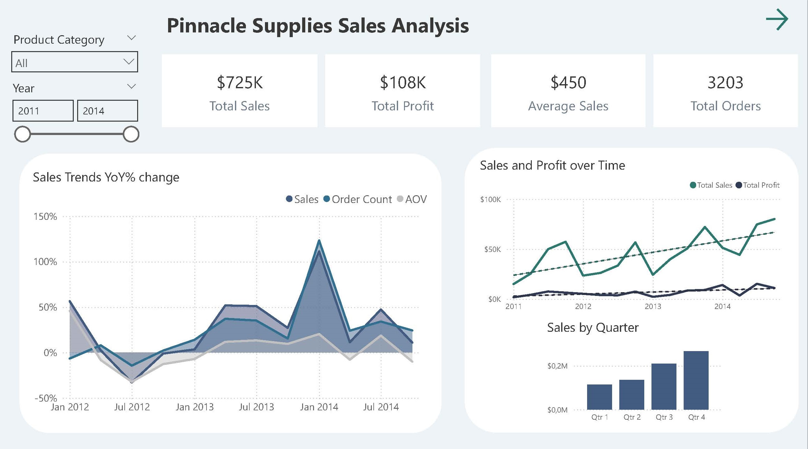

# Pinnacle Supplies

### Project background and overview
Pinnacle Supplies is a US-based company, specializing in office supplies and furniture. This project analyzed the data collected for the years 2011 to 2014 in order to uncover critical insights that will improve Pinnacle Supplies' commercial success.

Insights and recommendations are provided on the following key areas:

- Sales Trend Analysis: Evaluation of historical sales patterns, focusing on Sales, Order Volume and Average Order Value (AOV).
- Product Level Performance: An analysis of Pinnacle's product categories and individual products, assessing their contribution to total sales and profitability.
- Shipping Delay Analysis: An exploration of shipping performance, to identify trends in regions and products contributing to delays.

Recommendations will be used by the marketing team to better allocate resources, as well as by management to adjust shipping strategies, improve logistics efficiency, and reduce delivery delays.

### Data structure overview
Pinnacle Supplies' database structure as seen below consist of three tables: Sales, Customer and Product with a total row count of 6425.

. 

### Executive summary
**Overview of Findings**

Overall, the company's sales demonstrated an upward trajectory, with positive year-over-year (YoY) growth observed in most quarters. In 2014, All Key Prformance Indicators (KPIs) showed positive growth: sales (34%), order volume (37%) and AOV (4%). The rate of growth of AOV however slowed from 7% in 2013 to 4% in 2014.
Below is the overview page from the PowerBI dashboard and more examples are included throughout the report. 

**Sales trends**

A cyclical trend is observed over the analyzed period, with the highest sales made in Q4 of each year and the lowest sales in Q1 or Q2 of each year.
However in Q3 of 2012, the company experienced a 33% YoY decline in sales while Q1 of 2014 saw an exceptional 111% YoY increase in sales, marking the highest growth spike across all quarters analyzed. Sales in Paper products were the main driver of this sharp increase.

**Product Performance**

In Q1 of 2014, the Paper category showed the greatest sales increase, with YOY growth of 2642%. Sales growth in this category however declined in Q2 but recovered to 478% in Q3. Growth in other categories were not as notable,  
The single product achieving the greatest sales and profit in 2014 was Xerox 1898, with $14225 in sales and $6801 in profit. Other high-performing products in this year included Letter Size Cart and Anker Astro Mini 3000mAh Ultra-Compact Portable Charger. 

**Shipping Delay**

Overall, the longest delay times were seen in Storage, Labels and Appliances categories (4.3 days on average). However in 2014, the highest delay was seen in Supplies category products (5.4 days on average).
In 2014, 72 products (7% of products) had an average shipping delay of 6 days or longer. These products accounted for $46123 in sales (18% of sales).
In previous years, Q2 or Q3 typically saw the greatest shipping delays, however in 2014, the greatest delays were observed in Q1 and Q4.
The states of Montana and New Mexico experienced the longest delay times in 2014, however these states also account for a relatively small number of total orders.

**Customer analysis**

Repeat customers make up approximately 70% of Pinnacle's customer base and more than 80% of customers are either repeat customers or Loyalty Program members. 44% of customers are however repeat customers but not members of the Loyalty Program.
Order volume is relatively similar across weekdays, with lower order volumes on weekends, A much lower order volume is observed on Sundays. 
The largest proportion of customers are within the 24 to 35 age range with 64% of total orders made from customers in California.

### Recommendations
Based on the uncovered insights, the following recommendations are provided:

- Investigate the exceptional growth in Q1 of 2014 and whether these are tied to seasonal or promotional factors. Understanding the drivers behind this occurrence can help replicate it in future.
- Continue to focus on the promotion of high-performing products such as Xerox 1898, Letter Size Cart, and Anker Astro Mini 3000mAh Ultra-Compact Portable Charger as these have shown strong sales and profits. Additionally, consider bundling them with lower-performing items to boost overall sales.
-  Investigate the root causes of the delays in shipping of Supplies, Labels and Storage products —whether they’re due to inventory management, supplier issues, or shipping logistics. Consider partnering with third-party logistics providers or optimizing warehouse processes to reduce delays.
- Consider incentivizing repeat customers to join the loyalty program, such as offering exclusive discounts or early access to promotions.
